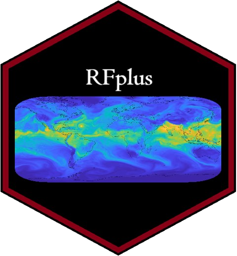

# **RFplus:** *A Novel Machine Learning Approach for Merging Multi-Satellite Precipitation Products and Ground Observations* 

<!-- CRAN:Check -->

[](https://github.com/Jonnathan-Landi/RFplus/actions/workflows/R-CMD-check.yaml) [](https://cran.r-project.org/package=RFplus) [](https://www.r-pkg.org/pkg/RFplus)
[](https://app.codecov.io/gh/Jonnathan-Landi/RFplus)

# Overview

The RFplus package implements a novel spatial extrapolation and bias correction framework, integrating Random Forest (RF) and Quantile Mapping (QM) in a multi-stage process to improve the accuracy of satellite precipitation estimates. The methodology consists of three key stages:

1.  **Spatial Extrapolation of Precipitation:** The first stage employs a Random Forest model to extrapolate the spatial distribution of precipitation. The model is trained using in-situ measurements as the response variable and a diverse set of satellite precipitation products and environmental covariates as predictors. This approach enables the generation of an initial precipitation field that extends observed precipitation patterns across unmonitored regions with high spatial flexibility, allowing applications at different temporal scales (e.g., daily, monthly, or annual).

2.  **Residual Correction through a Secondary RF Model:** To enhance predictive accuracy, a second Random Forest model is trained to estimate residual errors from the initial predictions. The residuals are defined as the difference between observed and modeled precipitation values at station locations. By modeling these residuals as a function of the same covariates used in the first stage, systematic biases are identified and corrected iteratively. The corrected precipitation estimate is obtained by summing the residual predictions to the initial RF-based precipitation estimates, leading to a refined precipitation product with reduced bias and improved spatial coherence.

3.  **Bias Adjustment via Non-Parametric Quantile Mapping (QM):** In the third stage, a nonparametric quantile mapping (QM) is applied to adapt the distribution of each time series to the in situ observations of the nearest station. The QM correction will be applied to those pixels that meet the proximity criterion, which states that only pixels within a predefined radius of influence (e.g., ≤15 km) are QM corrected.

The RFplus package is designed to be highly adaptable and can be utilized across various satellite precipitation products and geographic regions. Although initially developed for precipitation bias correction, its methodology is applicable to other environmental variables such as temperature, wind speed, and soil moisture. This versatility makes RFplus a powerful tool for enhancing the accuracy of remote sensing-based estimations across diverse environmental conditions.

# Key Requirements for RFplus

To ensure the optimal performance of RFplus, the following requirements must be met:

1.  **Data Quality:** In situ station data must undergo rigorous quality control and homogenization before use.
2.  Stations should have less than 10% missing data to avoid skewing the quantile correction.
3.  **Input Data Consistency:**
    -   Covariates must share the same spatial extent and coordinate reference system (CRS).

    -   All covariates should have the same number of layers.
4.  **Mandatory Use of DEM:**
    -   A DEM is required as an input parameter.

    -   The DEM should have a single layer, which will be replicated to match the number of layers in other covariates.
5.  **Covariate Structure:**
    -   Covariates should be provided as a list of raster layers.

    -   The classes of all covariates must be consistent.

# Installation

`RFplus` is available on CRAN, so, to get the current version you can use:

``` r
install.packages("RFplus")
```

If you want to test the development version, you can do it from [GitHub](https://github.com/Jonnathan-Landi/RFplus):

``` r
if (!require(devtools)) install.packages("devtools") 
library(devtools) 
install_github("Jonnathan-Landi/RFplus")
```

# Example using RFplus

Example of a RFplus run using the example data.

``` r
library(RFplus)
library(terra)
library(data.table)

# Load the data
data("BD_Insitu", package = "RFplus")
data("Cords_Insitu", package = "RFplus")

# Load the covariates
Covariates <- list(
 MSWEP = terra::rast(system.file("extdata/MSWEP.nc", package = "RFplus")),
 CHIRPS = terra::rast(system.file("extdata/CHIRPS.nc", package = "RFplus")),
 DEM = terra::rast(system.file("extdata/DEM.nc", package = "RFplus"))
 )

# Apply the RFplus bias correction model
model = RFplus(BD_Insitu, Cords_Insitu, Covariates, n_round = 1, wet.day = 0.1, ntree = 2000, seed = 123, training = 0.8, Rain_threshold = 0.1, method = "RQUANT", ratio = 5, save_model = FALSE, name_save = NULL
)

# Visualize the results
# Precipitation results within the study area
modelo_rainfall = model$Ensamble

# Validation statistic results 
metrics = model$Validation
# Note: In the above example we used 80% of the data for training and 20% for # model validation.  
```

# Limitations and Future Research

Currently, the RFplus algorithm does not support parallel mode execution, which means that, when working with large volumes of data, the processing time can be long. Research is currently underway on how to integrate parallel execution capability to improve efficiency and reduce computation time in future uses of the algorithm.
